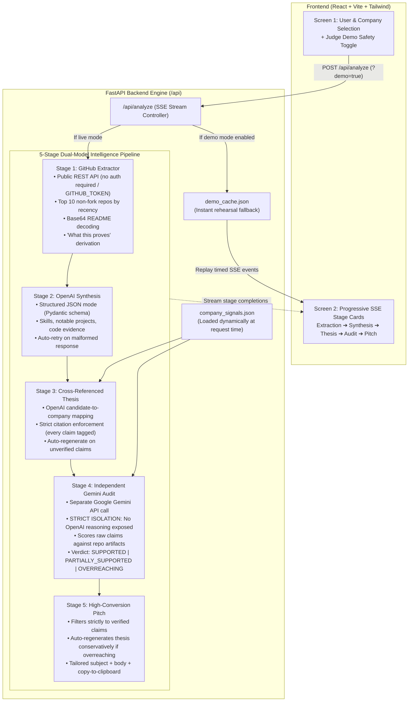

# Unlisted — Precision Engineering Talent Intelligence Engine

> **Turn verified GitHub repository proof into high-conviction, unlisted engineering roles with independent Google Gemini audit.**

Unlisted connects public open-source code artifacts with unlisted company technical signals. It extracts public GitHub repositories, performs structured technical synthesis, formulates an evidenced role thesis, independently audits all claims using Google Gemini with strict prompt isolation, and drafts a high-conversion recruiter outreach pitch.

---

## 🏗️ Architecture & Pipeline Flow



---

## ⚡ Quick Start (< 5 Minutes)

### Prerequisites
- Python 3.9+ installed
- OpenAI API Key & Google Gemini API Key *(Optional for Judge Demo Safety mode)*

### 1. Clone & Set Up Backend

```bash
# Navigate to backend directory
cd backend

# Create virtual environment
python3 -m venv venv
source venv/bin/activate

# Install dependencies
pip install -r requirements.txt

# Configure environment variables
cp .env.example .env
# Edit .env with your keys:
# OPENAI_API_KEY=your_key
# GEMINI_API_KEY=your_key
# GITHUB_TOKEN=your_token (optional, raises rate limits from 60 to 5000/hr)

# Run backend development server
uvicorn main:app --host 0.0.0.0 --port 8000 --reload
```

Backend will be live at `http://localhost:8000`. Verify with `curl http://localhost:8000/api/health`.

### 2. Open the Frontend

The frontend is a single self-contained file, `frontend/index.html` (no build step, no npm). Either:

- open `http://localhost:8000/` (the backend serves `backend/static/index.html`; copy `frontend/index.html` there after edits), or
- open `frontend/index.html` directly from disk. It calls `http://localhost:8000` by default; override with `?api=http://host:port`.

---

## 🛡️ Judge Demo Safety Mode

To guarantee flawless live demonstrations in front of judges regardless of venue Wi-Fi or third-party API rate limits, Unlisted includes a built-in **Demo Safety Mode**:

1. **URL Flag**: Append `?demo=true` to the URL (`http://localhost:5173/?demo=true`).
2. **UI Toggle**: Click the **Judge Demo Safety [ON/OFF]** switch in the top header or main search form.
3. **Behavior**: Streams real pre-computed outputs from `backend/demo_cache.json` stage-by-stage with smooth pacing (`~700ms` per stage), giving judges an identical progressive rendering experience.
4. **Rehearsal Profile**: Pre-configured with Sebastián Ramírez (`tiangolo`, creator of FastAPI & SQLModel) targeting **Supabase**.

### Modifying Company Signals On-The-Fly
`backend/company_signals.json` is loaded **dynamically at request time**. You can edit real engineering blog excerpts or job posting requirements between pitch runs without restarting the server or redeploying.

---

## 🧪 Running Unit Tests

The backend includes comprehensive unit tests verifying GitHub extraction, base64 README decoding, Pydantic schema validation, thesis source verification, and independent Gemini verdict parsing:

```bash
cd backend
source ../venv/bin/activate
pytest -v
```

All 13 tests execute with mocked API responses to ensure prompt formatting and validation logic never fail in production.

---

## 🐳 Docker Deployment

You can build and run the unified container locally:

```bash
# Build unified production container
docker build -t unlisted-app ./backend

# Run container with environment variables
docker run -p 8080:8080 \
  -e PORT=8080 \
  -e OPENAI_API_KEY="your-openai-api-key" \
  -e GEMINI_API_KEY="your-gemini-api-key" \
  -e GITHUB_TOKEN="your-github-token" \
  unlisted-app
```

Visit `http://localhost:8080` to access the full-stack app.

---

## 🚀 Deploying to Google Cloud Run

### Option 1: One-Command Cloud Build & Deploy (Recommended)

Set your Google Cloud project ID and run:

```bash
gcloud builds submit --config cloudbuild.yaml --substitutions=_PROJECT_ID="[YOUR_GCP_PROJECT_ID]"
```

### Option 2: Direct `gcloud run deploy` from Source

```bash
# 1. Build the frontend production bundle
cd frontend && npm run build && cd ..

# 2. Copy production assets into backend static folder
mkdir -p backend/static && cp -r frontend/dist/* backend/static/

# 3. Deploy single-container full-stack app to Google Cloud Run
gcloud run deploy unlisted-app \
  --source ./backend \
  --project "[YOUR_GCP_PROJECT_ID]" \
  --region us-central1 \
  --platform managed \
  --allow-unauthenticated \
  --port 8080 \
  --set-env-vars HOST=0.0.0.0,PORT=8080 \
  --set-secrets OPENAI_API_KEY=OPENAI_API_KEY:latest,GEMINI_API_KEY=GEMINI_API_KEY:latest
```

---

## 📑 API Contract Reference

### `GET /api/companies`
Returns available target organizations for dropdown selection:
```json
[
  {
    "id": "supabase",
    "name": "Supabase",
    "description": "Open source Firebase alternative built on PostgreSQL"
  }
]
```

### `POST /api/analyze`
**Request Body:**
```json
{
  "github_username": "tiangolo",
  "company_id": "supabase",
  "demo": false
}
```

**SSE Event Stream Response:**
- `data: {"stage": "extraction", "status": "done", "data": {...}}`
- `data: {"stage": "synthesis", "status": "done", "data": {...}}`
- `data: {"stage": "thesis", "status": "done", "data": {...}}`
- `data: {"stage": "verification", "status": "done", "data": {"verdict": "SUPPORTED", "reason": "..."}}`
- `data: {"stage": "pitch", "status": "done", "data": {"subject": "...", "outreach_message": "..."}}`

**Error Event:**
If any stage fails, the pipeline halts gracefully and emits an inline error without crashing:
- `data: {"stage": "<stage_name>", "status": "error", "message": "<user-safe error description>"}`

---

## ⚖️ License
MIT License. Built for precision talent intelligence.
